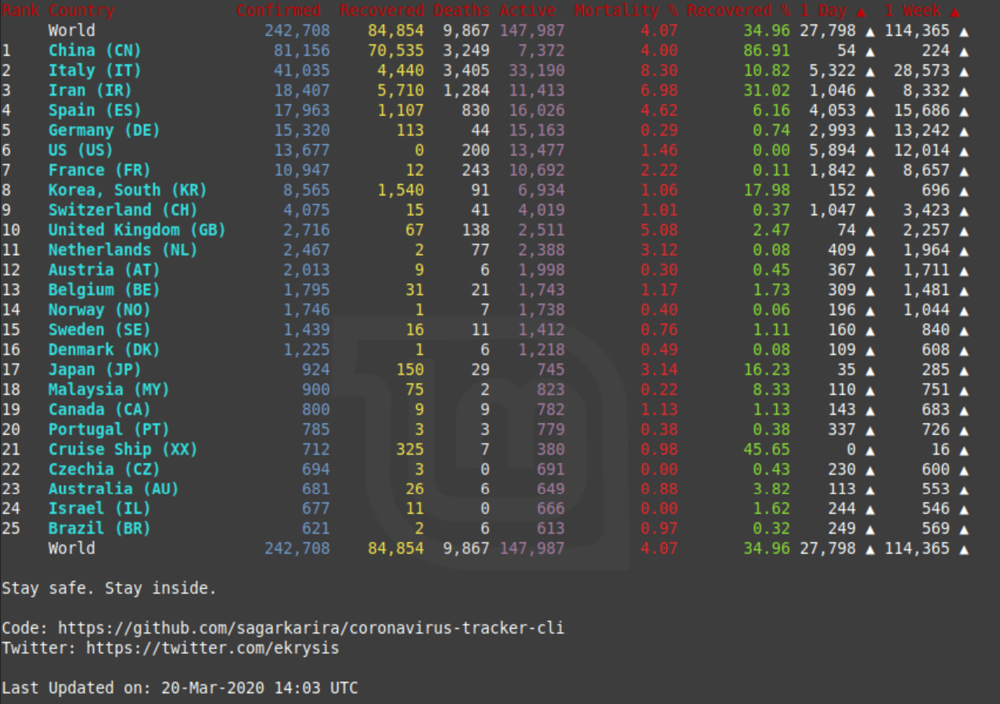

<h1 align="center">
    Coronavirus Tracker CLI
</h1>


Track The Corona virus stats from your terminal using curl or global command.

[](https://github.com/sagarkarira/coronavirus-tracker-cli/actions?workflow=Tests)
[](https://img.shields.io/twitter/url?style=social&url=https%3A%2F%2Fgithub.com%2Fsagarkarira%2Fcoronavirus-tracker-cli%2F)


**Live global stats (provided by [fight-covid19/bagdes](https://github.com/fight-covid19/bagdes))**


## Screenshot



## Data Sources

* Source 1 : [Johns Hopkins Data API](https://github.com/ExpDev07/coronavirus-tracker-api)
* Source 2 : [WorldoMeters Data API](https://github.com/NovelCOVID/API/) updated very frequently.

**Note: Source 2 is the default source now if not mentioned**

## CURL

```sh
# Get data from worldometers api i.e source 2
curl https://corona-stats.online

# Get data from source 1
curl https://corona-stats.online?source=1

# Get data from source 2
curl https://corona-stats.online?source=2

# Filter by country /countryCode or /countryName

curl https://corona-stats.online/US
curl https://corona-stats.online/italy
curl https://corona-stats.online/uk?source=2
curl https://corona-stats.online/gb?source=1

# State wise stats of country (Only for US as of now)

curl https://corona-stats.online/US

# Only show top N countries
curl https://corona-stats.online?top=20

# Remove padding and borders from table
curl https://corona-stats.online?minimal=true

# Latest News (Work In Progress)
curl https://corona-stats.online/updates

# Allow emojis (emojis breaks in some terminals)
curl https://corona-stats.online?emojis=true

# Help
curl https://corona-stats.online/help

# Mix up above params (One that I use)
curl 'https://corona-stats.online?top=30&source=2&minimal=true&emojis=true'

```

## API

Add `?format=json` at the end of any API to get JSON formatted data.

```sh
curl https://corona-stats.online?format=json
```

## Node CLI

Note: NodeJS version 12 recommended. You can download it [here](https://nodejs.org/en/download/).

**Install**

``` sh
# Install
npm install coronavirus-tracker-cli -g

# Run command
corona 

# Get source 1 data
corona --source=1
corona -s=1

# Filter by country
corona italy

# state wise stats (only for US as of now)
corona --states=US
corona --st=us

# Filter top N countries
corona --top=10
corona -t=10

# Minimal Compact Table
corona --minimal
corona -m

# Monocolor / No colors
corona --color=false
corona -c=false

# Show emojis
corona --emojis
corona -e

# Confirmed Cases Graph
corona italy --graph
corona italy -g
```

## ToDos

* ~~Filter by country to get cases by local states.~~
* ~~Move from npm to curl~~
* ~~Add daily change.~~
* ~~Add graphs~~
* Add growth rate column ? (double in X days)
* Add latest updates from reddit / twitter.
* Find and add regional data - state, county, city, district level data.

## Contributors

```text
 project  : curl-corona
 lines    :     3991
 authors  :
  3342 Sagar Karira             83.7%
  356 XhmikosR                  8.9%
  232 Alexandra Parker          5.8%
   26 Lucas Fernandez Nicolau   0.7%
   13 Daniel S                  0.3%
   10 Shelton Koskie            0.3%
    5 Sabu Siyad                0.1%
    4 Mo'men Tawfik             0.1%
    2 Steven                    0.1%
    1 Greg Myers                0.0%
```

## Other Regional Trackers

* [Italy](https://opendatadpc.maps.arcgis.com/apps/opsdashboard/index.html#/b0c68bce2cce478eaac82fe38d4138b1)
* [India](https://www.covid19india.org/)
* [USA](https://www.npr.org/sections/health-shots/2020/03/16/816707182/map-tracking-the-spread-of-the-coronavirus-in-the-u-s)
* [France](https://veille-coronavirus.fr/)
* [Japan](https://covid19japan.com/)
* [Philippines](https://ncovtracker.doh.gov.ph/)
* [Austria (official)](https://info.gesundheitsministerium.at), [Austria (inofficial but more detailed)](https://covid19.spiessknafl.at)

## Related Projects

* <https://github.com/NovelCOVID/API>
* <https://github.com/javieraviles/covidAPI>
* <https://github.com/mathdroid/covid-19-api>
* <https://github.com/warengonzaga/covid19-tracker-cli>
* <https://github.com/ahmadawais/corona-cli>
* <https://github.com/ebwinters/CoronaTracker>

## Sponsored By

* [Zeit Now](https://github.com/zeit/now).

## License

[WTFPL](http://www.wtfpl.net/)
